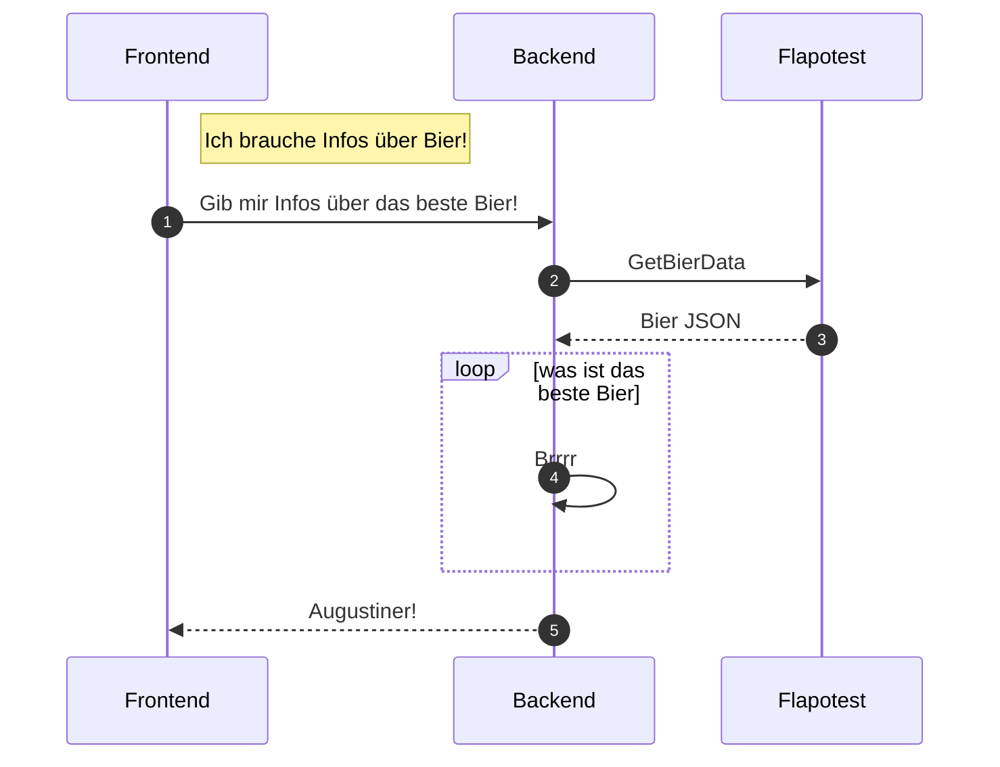

# FlaschenpostAPI
This is just a simple REST API, it grabs data from a public API

```mermaid
sequenceDiagram
    autonumber
    Note right of Frontend: Ich brauche Infos über Bier!
    Frontend->>Backend: Gib mir Infos über das beste Bier!
    Backend->>Flapotest: GetBierData
    Flapotest-->>Backend: Bier JSON
    loop was ist das beste Bier
        Backend->>Backend: Brrrr 
    end
    Backend-->>Frontend: Augustiner!
```
