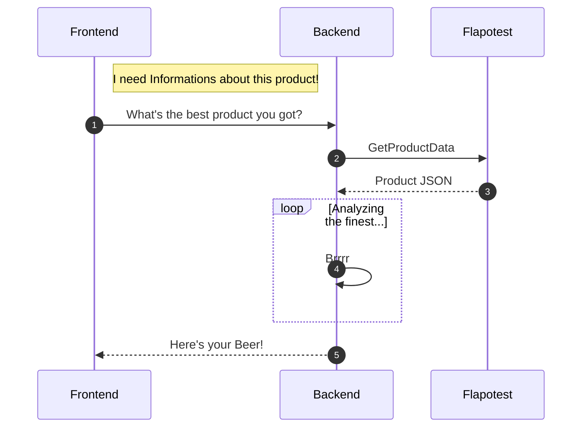

<!-- PROJECT LOGO -->
 

<blockquote>
  
Source: DALL-E 3

</blockquote>

# 🍺 bl_bottleApi API 🚀

Ahoy, mateys! Welcome aboard the BottlePost API! This API is like a digital message in a bottle, tossed into the vast ocean of the internet to bring you the best data on brews from public shores. 🌊

## What's This All About? 🤔

This .NET 6 RESTful API is your first mate when it comes to fetching drink data from a public endpoint. It's not just about grabbing data – it's about churning through the sea of information, calculating, and returning the finest selection of liquid treasure. 🏆

# A Journey Through Time ⏳

This repository is an old vessel, charting the first course through my GitHub adventures. It was crafted as a proof of concept to explore the realms of API development and hosting public repositories.
No Strings Attached 🎫

The BottlePost API comes with no license attached. It's a free spirit, meant for educational voyages and proof-of-concept explorations. Use it as a guidepost or an inspiration for your own digital quests.
# Why Visit This Isle? 🏝️

    Proof of Concept: See what's possible with .NET 6 and RESTful APIs.
    Open Source Journey: A glimpse into the evolution of a developer's public GitHub presence.
    Unlicensed Treasure: Dive in and explore without the need to walk the plank over licensing issues.

So, grab your compass 🧭 and set sail for the code! Contributions and friendly banter are always welcome in the Issue Tracker or over Pull Requests.

Happy coding, and may you always have the wind in your sails! 🌬️🌟

Feel free to tweak the content to better match the tone and style of your project and personal branding on GitHub. Emojis can help make the README file more engaging and friendly to visitors.

It's a very old Repository of mine and I practically just used it to Proof some concepts
and also kind of to get started with hosting public Repositorys on GitHub.
I'm sorry, if you hoped to find something interesting in here. :P
